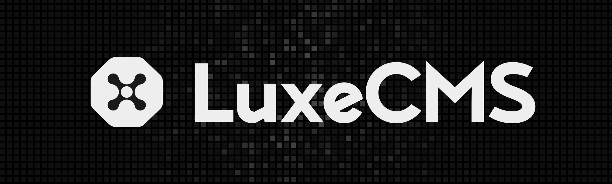

<div align="center">



The first truly composable headless CMS built for the modular web.

[](https://github.com/luxeCMS/luxe/blob/main/LICENSE)
[](https://discord.gg/6XzN3e8VCk)

> **Note:** LuxeCMS is under active development and is not production-ready. Join our [Discord](https://discord.gg/6XzN3e8VCk) to stay updated on the first stable release.

</div>

## Overview

LuxeCMS is a modular headless CMS that lets you build your content infrastructure like a composable frontend. Each content module is independent, type-safe, and API-first, allowing you to create, extend, and maintain content architectures that scale with your needs. Plugins extend the core functionality of each module, providing a flexible and extensible platform for building content-driven applications.

- **Truly Composable**: Build your content infrastructure using independent, interconnected modules
- **API-first & Headless**: GraphQL and REST endpoints with full TypeScript support
- **Extensible Core**: Add custom modules and extend existing ones with plugins
- **Developer Experience**: Built with TypeScript and modern development practices

This project would not be possible without inspiration from [Astro](https://astro.build/) and [Medusa](https://medusajs.com/).

## Quick Start

To get started with LuxeCMS, run the following command:

```bash
pnpm create luxe@lastest
# or
npm create luxe@lastest
```

Follow the steps in the CLI to create a new Luxe project.

## Contributing

We welcome contributions! See our [Contributing Guide](../../CONTRIBUTING.md) for details on:

- Setting up your development environment
- Making pull requests
- Our coding standards

Join our [Discord](https://discord.gg/6XzN3e8VCk) to connect with other contributors.

## License

MIT © [LuxeCMS Contributors](../../LICENSE.md)
